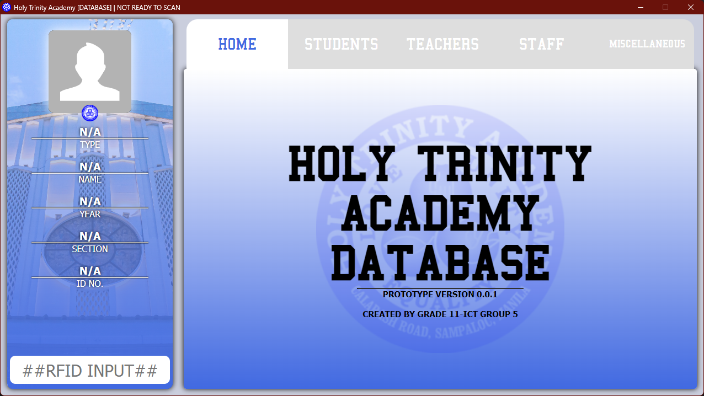

# SCHOOL DATABASE APPLICATION w/ RFID

This application prototype of soley made for our group project.

This application is free to use as long as you credit this repo. 

## How to use?
First you need these following requirements
- Node JS
- npm

**RFID reader is optional when debugging as it only reads the UID of the chip/id but recommended when running the project in the real world**.
RFID Reader that I'm currently using is `SL040 Ver1.1`

## Managing the UI
Its currently using *electron.js* because it's easy to design it using html and css but at a cost of large file size.

## PREVIEW

## Known issue
- If the application is too slow to start, exclude the folder from the windows defender realtime protection.
<a href="https://github.com/electron/electron/issues/29868#issuecomment-869049066">[<i>Windows Defender realtime protection causes slow boot for utility process</i>]</a>

    - Possible fix that it needs to be signed but since this is only a project prototype, I have no intentions of buying a certificate to make this application verified.

# Web Portal
- When running opening the Web Portal html, it must be running on a localhost server unless the